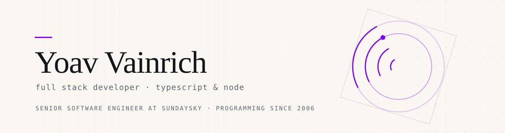

<picture>
  <source media="(prefers-color-scheme: dark)" srcset="resources/banner-dark.svg">
  
</picture>

Full stack developer from Israel. Senior Software Engineer at [SundaySky](https://sundaysky.com/). I work on a PostgreSQL, Express, React and Node (PERN) web app with both REST and GraphQL APIs. I also build serverless services on AWS.

Off the clock I write small Node tools that fix annoying things, mostly around npm, packaging, and the parts of a dev setup nobody wants to think about. If one of them saved you an afternoon, that's the whole idea.

### Things I've made

- **[create-windowless-app](https://github.com/yoavain/create-windowless-app)**: Scaffold a Node app that runs with no console window. [`npm`](https://www.npmjs.com/package/create-windowless-app) 
- **[fix-lockfile-integrity](https://github.com/yoavain/fix-lockfile-integrity)**: Repairs broken integrity hashes in `package-lock.json`. [`npm`](https://www.npmjs.com/package/fix-lockfile-integrity) 
- **[screwzira-subtitle-downloader](https://github.com/yoavain/screwzira-subtitle-downloader)**: Fetches Hebrew subtitles for whatever you're watching, automatically. 
- **[easylists-for-pihole](https://github.com/yoavain/easylists-for-pihole)**: EasyList blocklists, converted into something Pi-hole can eat.

### Also, this puzzle game

**[Calendar Puzzle](https://calendar-puzzle.yoavain.org/)**: Fit eight pieces onto the board so only today's month and day stay uncovered. Plays in the browser, no install. [source](https://github.com/yoavain/calendar-puzzle)

### Contributed to

Fixes and features merged into tools other developers depend on.

- **[node-notifier](https://github.com/mikaelbr/node-notifier)**: Desktop notifications for Node, 5M downloads/week.
- **[wawoff2](https://github.com/fontello/wawoff2)**: WOFF2 font compression and decompression.
- **[lockfile-lint](https://github.com/lirantal/lockfile-lint)**: Lockfile security linting.
- **[IntelliJ Extra Icons](https://github.com/jonathanlermitage/intellij-extra-icons-plugin)**: File-icon overrides for IntelliJ, 1.4M installs.
- **[webpack-build-notifier](https://github.com/RoccoC/webpack-build-notifier)**: Build notifications for Webpack.
- **[branch-name-lint](https://github.com/barzik/branch-name-lint)**: Branch naming conventions.
- **[npq](https://github.com/lirantal/npq)**: Pre-install auditing for npm packages.
- **[lockfix](https://github.com/kopach/lockfix)**: npm lockfile repair.
- **[ls-mcp](https://github.com/lirantal/ls-mcp)**: MCP server config discovery.

### Posts

Write-ups at [yoavain.github.io](https://yoavain.github.io/).

- **[The Weakest Link](https://yoavain.github.io/blog/the-weakest-link/)**: A font compressor, an unhandled rejection, and the blast radius of a dependency.

### What I reach for

- **Every day**: TypeScript, Node.js, React, GraphQL / Apollo
- **Also fluent**: Java, Bash, Batch
- **Data**: PostgreSQL, MySQL, DynamoDB
- **Build & ship**: AWS, GitHub Actions, Jenkins, Git, Webpack, Vite, Jest

The full inventory, if you're curious

 

Claude Code · IntelliJ · Docker · Serverless · Lerna · Nx · Express · Fastify · ESLint · GraphQL Code Generator · Flyway · NSIS · Electron · Renovate · Dependabot · Snyk · Verdaccio

### Say hi

Issues and PRs on any of the above are genuinely welcome; small PRs with a screenshot are my favourite kind.

